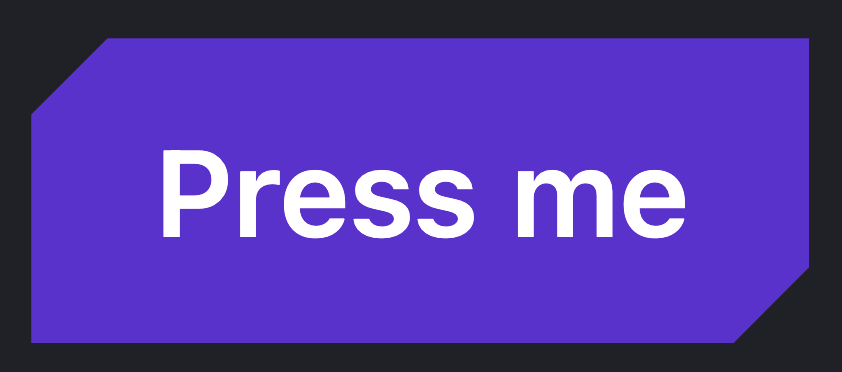
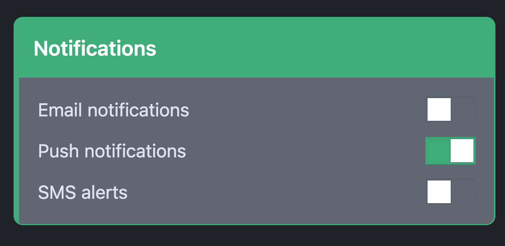
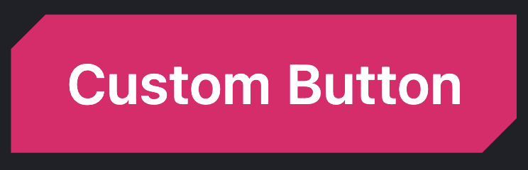

# ERGO-UI

A modern/futuristic componet library built using React, Typescript and Tailwindcss

## Sharp Components

Create sharp components by passing in the _sharp_ prop.

```typescript
<Button variant='primary' sharp />
```



### Mix and match between sharp and curved

Perhaps you want a curved parent component which features a sharp child. Simply pass the sharp prop to whatever component. It's entirely up to you!

```typescript
   <Card variant="primary" title="Notifications">
      <div className="flex flex-col gap-3">
        <div className="flex items-center justify-between">
          <span>Email notifications</span>
          <Toggle sharp />
        </div>
        <div className="flex items-center justify-between">
          <span>Push notifications</span>
          <Toggle sharp />
        </div>
        <div className="flex items-center justify-between">
          <span>SMS alerts</span>
          <Toggle sharp />
        </div>
      </div>
```



### Want to use your own colour? No problem

Simply pass in your custom colour and let the component handle the rest

```typescript
  <Button customColour='#e60076' sharp>
        Custom Button
 </Button>
```


